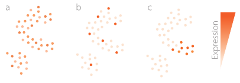
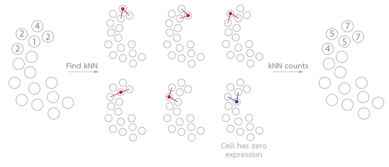
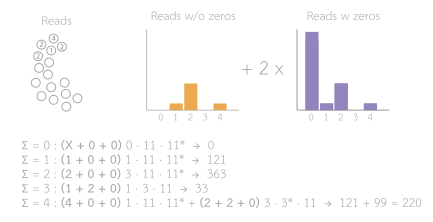

How does triku work?
====================

Feature selection methods in single cell analysis are generally based on two branches: methods
that rely on variance-related metrics, and methods based on distributions or other properties
inferred from the structure of the dataset. The first type of methods, based on variance, select the
most variable genes, with different adjustments, making the assumption that genes with
higher variance will be relevant for the structure of the dataset. On the other hand,
the second type of methods rely on metrics like the percentage of zeros, or assume that
read counts follow a negative binomial distribution, and select genes that are off of that
expected distribution.

Triku belongs to the second type of feature selection methods. The rationale behind triku is
that, if a gene is biologically relevant, it will have a localized expression, that is,
cells with similar transcriptomic profiles should have similar expression of that gene.

Based on that premise, there are three scenarios for a gene
expression pattern

Case *a* is that the expression is generalized across all cells. Those genes are not interesting
because they do not give information about specific cells that are expressing it. Case *b* is a
gene that is expressed in few cells, but those cells are not transcriptomically related.
This is is also uninteresting, because we expect the gene to be expressed in groups
of similar cells with similar functions. The case *c* is the interesting one, because the
expression is focused on a set of similar cells.

Generally, other feature methods cannot discriminate between cases *b* and *c*. Triku tries
to discriminate between them looking at the expression in the nearest neighbours, that is,
triku calculates for each cell which are their most similar cells (neighbours), looks
at their expression, and sums their expression value to the expression of the cell.
Since many cells are not expresses, triku does not consider the expression in the neighbours
if the cell has no expression.

Considering the expression in the neighbours is interesting because we transform
the distribution of expression in the cells with the distribution of expression considering
the neighbours. If a gene is of type *b* or *c* the distribution of expression values
will be skewed, but in case *c* the distribution of expression considering the neighbours
will be even more skewed.

The key point of triku is that, once the distribution of expression is calculated
for each gene, we need to calculate the expected distribution. If :math:`k` cells are chosen
to construct the distribution of expression, the expected distribution would be the one
after choosing :math:`k` cells at random.

In this example, the expression for each cell is shown in the left (blank cells are white
in the image); and the distribution of reads (not considering zeros, and considering them)
are shown on the right. Since we consider :math:`k = 2`, we will sum the distributions, and get the
expected distribution.

Each value of the new distribution represents the probability of summing :math:`N` reads
in :math:`k` cells. In the example, :math:`4` reads can be summed in 4 ways: 0 + 0 + 4,
0 + 1 + 3, 0 + 2 + 2, 1 + 1 + 2 (that is, two cells have 1 read, and 1 cell two reads).
Of these option, only 0 + 0 + 4 and 0 + 2 + 2 combinations are available. Since there are 11
cells with 0 counts and 3 cells with 2 counts, the number of combinations are 3 · 3 · 11 = 99.

In reality, we should consider the number of combinations without replacement, that is,
once one cell has been chosen it should not be chosen again. For example, in the
previous case it should be 3 · 2 · 11 = 66. However, this calculation is computationally expensive,
whereas the first one is not and, also, the difference in distributions is
insignificant with high numbers of cells and with the common range of neighbours.

Comparing the observed and expected distributions
^^^^^^^^^^^^^^^^^^^^^^^^^^^^^^^^^^^^^^^^^^^^^^^^^^^^
Once the observed and expected distributions have been calculated, we will compare
them by measuring their Wasserstein distance. The Wasserstein distance ranges from 0 to
:math:`\infty`, and it increases when the two distributions are more different.

Triku calculates the distance for all genes, and then performs a ranking. The genes with highest
Wasserstein distance are selected.

More!
~~~~~~~~~
This is the core on how triku works. If you want to learn more about how triku
works, you can read `our paper <https://doi.org/10.1093/gigascience/giac017>`_. Don't forget to cite it if you find triku useful!

> Alex M Ascensión, Olga Ibáñez-Solé, Iñaki Inza, Ander Izeta, Marcos J Araúzo-Bravo, Triku: a feature selection method based on nearest neighbors for single-cell data, GigaScience, Volume 11, 2022, giac017, https://doi.org/10.1093/gigascience/giac017
